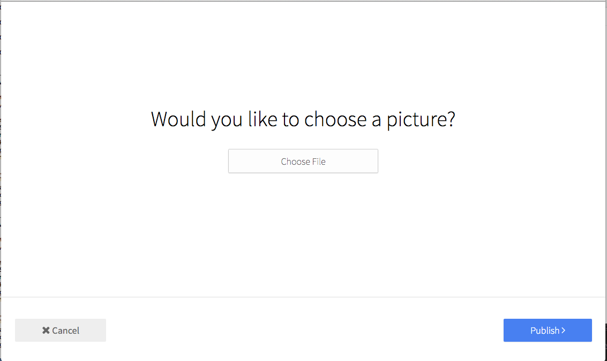

# Form: Profile Image

Set a user image (modal form)



```jsx
import ModalBtn from 'patchkit-modal/btn'
import FormProfileImage from 'patchkit-form-profile-image'

const onSubmit = (image, cb) => { console.log('submit', image); cb() }
<ModalBtn className="fullheight" Form={FormProfileImage} formProps={{currentValue: '/img/foo.png', className: 'text-center', onSubmit: onSubmit}}>
  <a className="btn highlighted">Click to open</a>
</ModalBtn>
```